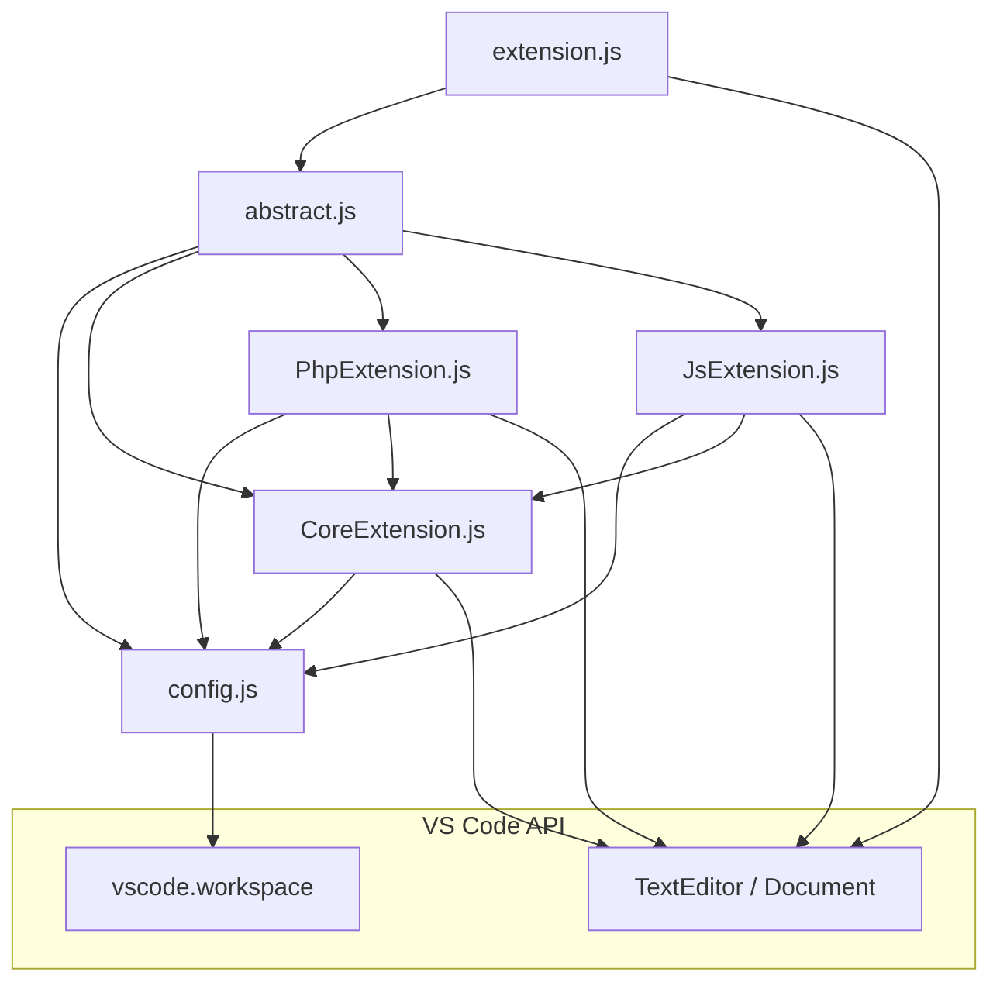
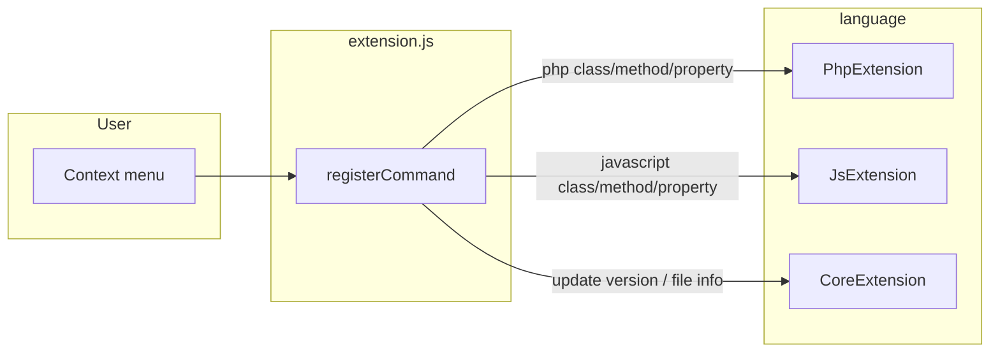
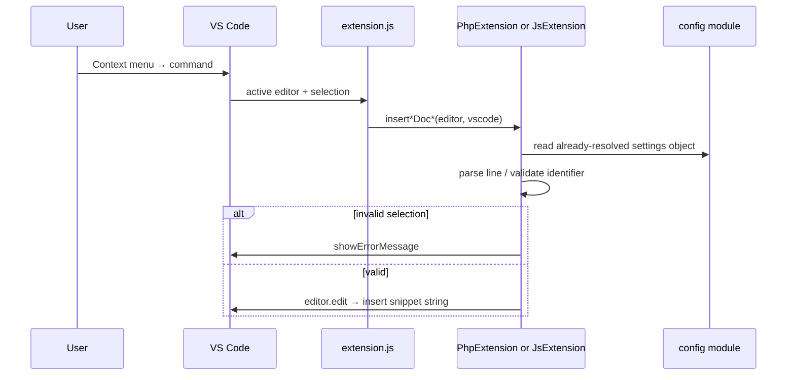

# Architecture

> Documentation index: [overview.md](overview.md)

## High-level

The extension is a thin **command layer** (`extension.js`) on top of a **language layer** (`language/*`). There is no database or network I/O: snippets are built as strings and applied via the **VS Code extension API** (same model in **VS Code** and **Cursor**).

## Module dependencies

- **`config.js`** reads `documate` settings once when the module is first loaded (same process as extension activation). After changing settings, users may need **Reload Window** for new values to apply everywhere.
- **`PhpExtension` / `JsExtension`** extend **`CoreExtension`** but only share the base class file; snippet builders use **`config`** directly.

## Command routing

Commands are registered in **`extension.js`**; each command maps to one static method on **`PhpExtension`**, **`JsExtension`**, or **`CoreExtension`**.

Language visibility in the UI is controlled by **`package.json`** `menus` `when` clauses (`editorLangId == php` / `javascript`), not by runtime checks in `extension.js`.

## Data flow (one insert)

**Validation:** class/method commands require the cursor’s word to match the regex on the **current line** (e.g. `class Foo` + word `Foo`). Property commands use a **word range** regex for PHP or `const|let|var` for JS.

## File-level snippet

**`CoreExtension.insertFileInfoSnippet`**: inserts a block at the start of the file, or **after** the first line if it is `<?php` / `<?`, so the PHP open tag stays first.

## Packaging note

**`.vscodeignore`** excludes `doc/**`, `sample/**`, tests, and dev-only files from the published `.vsix`. This documentation is for the **repository**, not shipped with the marketplace build unless you change ignore rules.

## Related

- [development.md](development.md) — local run and test  
- [reference.md](reference.md) — command IDs and configuration keys  
